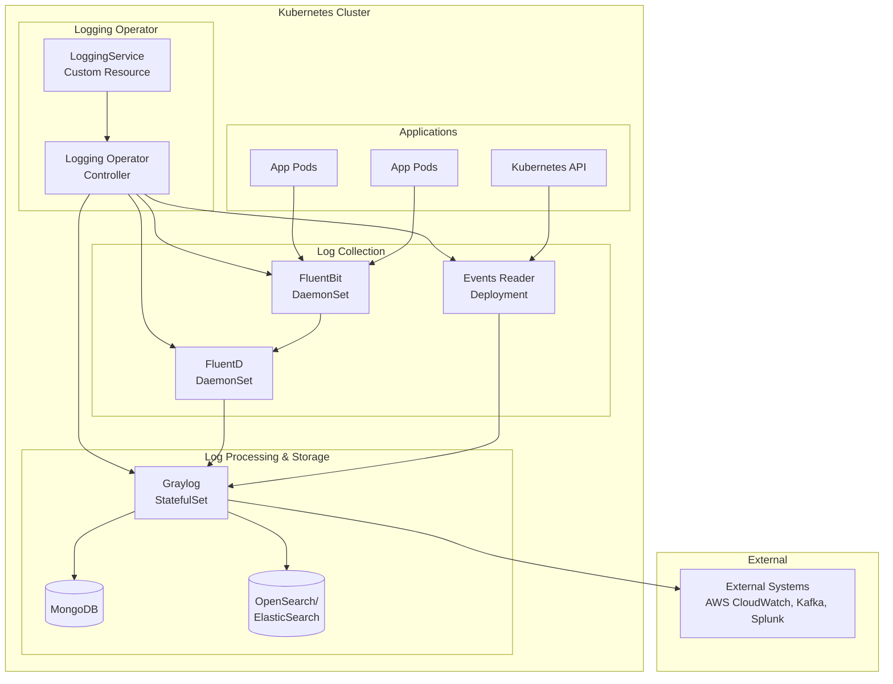

# Qubership Logging Operator

[](https://golang.org/)
[](https://kubernetes.io/)
[](https://helm.sh/)
[](https://netcracker.github.io/qubership-logging-operator)

Kubernetes Operator for deploying and managing a comprehensive logging stack including Graylog, FluentD, FluentBit,
and K8S Events Reader.

<!-- toc -->

## Table of Contents

1. [Features](#features)
2. [Requirements](#requirements)
3. [Installation](#installation)
4. [Usage](#usage)
5. [Configuration](#configuration)
6. [API Reference](#api-reference)
7. [Architecture](#architecture)
8. [Testing](#testing)
9. [Contributing](#contributing)
10. [License](#license)

## Features

The main features are as follows:

* **Comprehensive Logging Stack**: Deploy Graylog, FluentD, FluentBit, and K8S Events Reader
* **Kubernetes Native**: Extend Kubernetes API with custom resources and controllers
* **Multi-Platform Support**: Kubernetes 1.21+ and OpenShift 4.10+ compatibility
* **Template-Based Deployment**: Logging deployment via customizable templates
* **High Availability**: Support for HA configurations
* **Cloud Integration**: AWS CloudWatch, Kafka, Splunk integrations
* **Security**: TLS support, RBAC, authentication proxy
* **Monitoring**: Built-in observability and troubleshooting tools
* **Integration Testing**: Automated testing framework

## Requirements

### Common Prerequisites

* **Kubernetes**: 1.21+ or OpenShift 4.10+
* **Command-line Tools**: kubectl 1.21+ or oc 4.10+
* **Package Manager**: Helm 3.0+
* **Go**: 1.24+ (for development)

### Storage Requirements

* **Persistent Volumes**: Required for Graylog (MongoDB and journald)
* **Storage Types**: Block storage recommended (NFS-like storage not supported)
* **OpenSearch/Elasticsearch**: Compatible versions depend on Graylog version

For detailed storage requirements, see the [Installation Guide](https://netcracker.github.io/qubership-logging-operator/installation/).

## Installation

### Quick Start with Helm

1. Add the Helm repository:

   ```bash
   helm repo add qubership-logging-operator https://netcracker.github.io/qubership-logging-operator
   helm repo update
   ```

2. Install the operator:

   ```bash
   helm install qubership-logging-operator qubership-logging-operator/qubership-logging-operator
   ```

3. Create a LoggingService custom resource to deploy your logging stack.

For comprehensive installation instructions, see the [Installation Guide](https://netcracker.github.io/qubership-logging-operator/installation/).

## Usage

The operator extends Kubernetes API by creating custom resources and controllers that watch these resources.
Deploy logging components by creating LoggingService custom resources.

Example usage and configuration can be found in the
[Examples](https://netcracker.github.io/qubership-logging-operator/examples/) section.

## Configuration

The operator supports extensive configuration options for all logging components:

* **FluentD**: Custom inputs, filters, and outputs
* **FluentBit**: Daemon set and stateful set configurations
* **Graylog**: Authentication, plugins, storage settings
* **K8S Events Reader**: Event filtering and forwarding

For detailed configuration options, see:

* [Configuration Guide](https://netcracker.github.io/qubership-logging-operator/graylog-configuration/)
* [Configuration Examples](https://netcracker.github.io/qubership-logging-operator/examples/)

## API Reference

Complete API documentation is available at:

* [API Reference](https://netcracker.github.io/qubership-logging-operator/api/)
* [Architecture & Components](https://netcracker.github.io/qubership-logging-operator/architecture/)

## Architecture

### System Overview



The operator follows the standard Kubernetes operator pattern, extending the API with custom resources and controllers.
For detailed architecture information, see the [Architecture Guide](https://netcracker.github.io/qubership-logging-operator/architecture/).

## Testing

The project includes comprehensive testing:

### Integration Tests

```bash
# Run integration tests
make test-integration
```

### Robot Framework Tests

```bash
# Run robot tests
cd test/robot-tests
pip install -r requirements.txt
robot src/tests/
```

For more testing information, see the test directories:

* `test/envtests/` - Environment tests
* `test/robot-tests/` - Robot framework tests

## Contributing

We'd love to accept patches and contributions to this project. Please follow these guidelines:

1. **Contributor License Agreement**: You must sign the [Contributor License Agreement](https://pages.netcracker.com/cla-main.html)
2. **Code of Conduct**: Read and follow the [Code of Conduct](CODE-OF-CONDUCT.md)
3. **Development**: See [CONTRIBUTING.md](CONTRIBUTING.md) for detailed contribution guidelines

## License

This project is licensed under the Apache License 2.0 - see the [LICENSE](LICENSE) file for details.
