# Qubership Logging Operator

The Qubership Logging Operator simplifies the deployment and management of comprehensive logging infrastructure in
Kubernetes environments. This operator automates the setup and configuration of enterprise-grade logging components
to provide centralized log collection, processing, and analysis.

## What is Qubership Logging Operator?

The Logging Operator is a Kubernetes-native solution that deploys and manages the following components:

- **Graylog** - Centralized log management and SIEM platform
- **FluentD** - Unified logging layer for data collection and consumption
- **FluentBit** - Lightweight log processor and forwarder
- **K8S Events Reader** - Kubernetes events collection and processing

## Key Features

- **Template-based Deployment** - Streamlined logging stack deployment using predefined templates
- **Multi-Platform Support** - Compatible with both Kubernetes and OpenShift environments
- **Flexible Agent Configuration** - Deploy FluentD, FluentBit, or both based on your requirements
- **Event Monitoring** - Comprehensive Kubernetes events collection and analysis
- **Integration Testing** - Built-in testing framework for validating deployments
- **High Availability** - Support for scalable and resilient logging infrastructure
- **Security-First** - TLS encryption, RBAC, and authentication proxy support

## Architecture Overview

The operator extends the Kubernetes API by creating custom resources and controllers that watch these resources.
This follows the established Kubernetes operator pattern for managing complex applications.

The logging pipeline flows as follows:

```mermaid
graph TD
    subgraph Sources ["📊 Log Sources"]
        A1[Applications]
        A2[System Logs]
        A3[Audit Logs]
        A4[K8s Events]
    end
    
    subgraph Agents ["🔄 Collection Agents"]
        B1[FluentBit - by default]
        B2[FluentD]
    end
    
    subgraph Processing ["⚙️ Processing Pipeline"]
        C1[Filtering]
        C2[Parsing]
        C3[Enrichment]
    end
    
    subgraph Storage ["💾 Storage & Analysis"]
        D1[Graylog - by default]
        D2[External Systems]
    end
    
    Sources --> Agents
    Agents --> Processing
    Processing --> Storage
```

## Getting Started

To begin using the Qubership Logging Operator:

1. Review the [Installation Guide](installation.md) for deployment instructions
2. Understand the [Architecture](architecture.md) and system components
3. Configure your logging stack using the [Configuration Guide](graylog-configuration.md)
4. Explore [Integration Options](integrations/aws-cloudwatch.md) for external systems

## Use Cases

The Qubership Logging Operator is ideal for:

- **Centralized Logging** - Aggregate logs from multiple applications and services
- **Compliance & Auditing** - Meet regulatory requirements with comprehensive log retention
- **Troubleshooting** - Rapid issue identification and resolution
- **Security Monitoring** - Real-time threat detection and analysis
- **Performance Monitoring** - Application and infrastructure performance insights

## Technology Stack

Built with modern cloud-native technologies:

- **Operator Framework** - Based on Operator SDK for Kubernetes automation
- **Go** - High-performance, compiled language for operator logic
- **Custom Resources** - Kubernetes-native API extensions
- **Helm Charts** - Templated deployment and configuration management

## Community & Support

This project follows the Kubernetes operator pattern and is built using the Operator SDK. For more information about
operators, visit the [Kubernetes Operator documentation](https://kubernetes.io/docs/concepts/extend-kubernetes/operator/).

For Operator SDK details, see the [official repository](https://github.com/operator-framework/operator-sdk).
