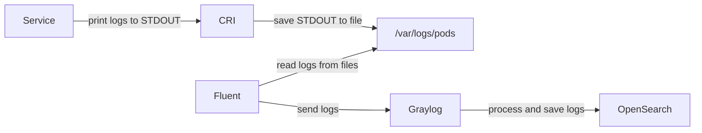

<!-- markdownlint-disable MD041 -->
This document describes different limits, restrictions, recommendations and best practices for logs.

# Limits

This section describes limits related to using a centralized log server.

## Common information

There is a lot of various information about different limits in all tools used in the Logging stack.
We try to aggregate all limits in one place and explain where users can encounter limits during saving or selecting logs.

Let's clear up a few misconceptions:

<!-- markdownlint-disable line-length -->
| Misconceptions                     | In fact                                                                                                                                                                                      |
| ---------------------------------- | -------------------------------------------------------------------------------------------------------------------------------------------------------------------------------------------- |
| Fluent has a log line limit        | FluentD and FluentBit have no hard limits that will truncate logs by size or length. However, they have different memory limits which may prevent reading or processing logs with huge size. |
| Graylog has a max logs size        | No, Graylog has no limits related to max message/log size. However, it uses OpenSearch to save logs. So you need to remember about these limits.                                             |
| OpenSearch has a max log size 32KB | No, it all depends on the field and whether it is one of the declared fields or a dynamic field.                                                                                             |
<!-- markdownlint-enable line-length -->

To parse logs generated by almost all pods we are using the chain:



## Limits for CRI

These limits apply when CRI saves logs from STDOUT to files.

<!-- markdownlint-disable line-length -->
| Type                          | Limits    |
| ----------------------------- | --------- |
| Container max log line length | `16 KiB`  |
| Container max log file size   | `5 files` |
| Container max log files       | `10 MiB`  |
<!-- markdownlint-enable line-length -->

All lines with a length greater than 16 KiB will be split into several records. Fluent can join them during reading.

**Warning!** Although CRI allows saving 4 additional files with old logs, Fluent reads only the last file,
without the `*.zip` extension. So Fluent can read (or re-read logs from the file head) only from the `*.log` file.
This means that in the case of a restart, it can re-read up to the last `10 MiB`.

## Limits for Fluent

This section describes limits for FluentBit and FluentD agents.

### Limits for FluentBit

The max length of a message is limited by the `tail` plugin max buffer size. The max buffer size is set
by the monitored file.

<!-- markdownlint-disable line-length -->
| Type                     | Limits   |
| ------------------------ | -------- |
| Max buffer size per file | `10 MiB` |
<!-- markdownlint-enable line-length -->

### Limits for FluentD

There are no fixed limits for reading logs from files. However, FluentD has a buffer where it saves all data during processing
and before sending them to storage. A large number of long lines can lead to a `BufferChunkOverflowError` in FluentD logs.

<!-- markdownlint-disable line-length -->
| Type            | Limits    |
| --------------- | --------- |
| Max buffer size | `512 MiB` |
<!-- markdownlint-enable line-length -->

## Limits for Graylog

Graylog has no fixed limits for logs and their fields (except limits provided by OpenSearch).

Graylog GELF UDP has the following limits:

<!-- markdownlint-disable line-length -->
| Type                      | Limits                       |
| ------------------------- | ---------------------------- |
| Character encoding system | `UTF-8`                      |
| Max GELF UDP chunks       | `128 chunks`                 |
| Max GELF UDP package size | `1420 bytes`                 |
| Max GELF UDP total size   | `181760 bytes` (~ `177 KiB`) |
<!-- markdownlint-enable line-length -->

## Limits for OpenSearch/Elasticsearch

### Limits for OpenSearch/Elasticsearch instance

Each OpenSearch Index generates N shards. In the case of a one-node OpenSearch, Graylog is configured
to create Indices with 1 shard per Index.

<!-- markdownlint-disable line-length -->
| Type                          | Limits        |
| ----------------------------- | ------------- |
| Max shards count per IndexSet | `1000 shards` |
<!-- markdownlint-enable line-length -->

This limit means that a maximum of `1000` Indices can be saved on one node.

### Limits for OpenSearch/Elasticsearch index

All limits described in this section apply **during saving** logs in OpenSearch.

Common limits per Index:

| Type                           | Limits        |
| ------------------------------ | ------------- |
| Max fields in the Index/Stream | `1000 fields` |

Limits for **predefined fields** in the default Graylog index mapping, such as the following:

* `message`
* `full_message`
* `source`

| Type                         | Limits                                  |
| ---------------------------- | --------------------------------------- |
| Max document size            | `2 GiB` (better keep less than 100 MiB) |
| Max words/terms in the field | `65536 words/terms`                     |
| Max word/term size           | `32 KiB` (8192 symbols for UTF-8)       |

Limits for **dynamic fields** (all other fields, not defined in the index mapping), for example:

* `level`
* `class`
* `requestId`
* `traceId`
* etc.

| Type                                     | Limits                            |
| ---------------------------------------- | --------------------------------- |
| Max length of the dynamic field name/key | `256 symbols`                     |
| Max length of the dynamic field value    | `32 KiB` (8192 symbols for UTF-8) |

### Limits for OpenSearch/Elasticsearch fields

<!-- markdownlint-disable line-length -->
| Field type   | Limits                                                                                                                     |
| ------------ | -------------------------------------------------------------------------------------------------------------------------- |
| `INT64`      | `-2^63~2^63-1`                                                                                                             |
| `FLOAT`      | `+/-3.40282e+038`                                                                                                          |
| `DOUBLE`     | `+/-1.79769e+308`                                                                                                          |
| `LITERAL`    | A field of this type can be up to `65535 bytes` in length                                                                  |
| `TEXT`       | A field of this type can be up to `65536 words` in length                                                                  |
| `SHORT_TEXT` | A field of this type can be up to `100 bytes` in length. If a field exceeds `100 bytes` in length, the field is truncated. |
| `KEYWORD`    | A field of this type can be up to `32766 bytes` in length                                                                  |
<!-- markdownlint-enable line-length -->

### Limits for OpenSearch/Elasticsearch during query data

All limits described in this section apply when users want to select logs from Graylog (from OpenSearch as storage).

<!-- markdownlint-disable line-length -->
| Type                                   | Limit     | Notes                                                                                                                                                    |
| -------------------------------------- | --------- | -------------------------------------------------------------------------------------------------------------------------------------------------------- |
| Max analyzed field length              | `1000000` | Fields with content length greater than this limit can't be selected from Index                                                                          |
| Max `Content-Length` for HTTP requests | `100MB`   | Although Graylog and OpenSearch almost have no limit for the `message` field, OpenSearch doesn't allow putting more than 100MB in a request to save data |
<!-- markdownlint-enable line-length -->

# Restrictions

This section describes different restrictions related to log parsing and using a centralized log server.

## Supported log levels

FluentBit and FluentD by itself can parse any log and log levels in the logs. However, we are using Graylog
as a centralized logging server. Output plugins used to send logs in Graylog restrict the list of supported
log levels.

FluentD supports the following log levels (case insensitive):

<!-- markdownlint-disable line-length -->
| Log levels in logs     | Applicable levels     | Log level in Graylog |
| ---------------------- | --------------------- | -------------------- |
| `0` or start from `e`  | `emerg`, `emergency`  | `Unknown`            |
| `1` or start from `a`  | `alert`               | `Unknown`            |
| `2` or start from `c`  | `crit`, `critical`    | `Critical`           |
| `3` or start from `er` | `error`               | `Error`              |
| `4` or start from `w`  | `warn`, `warning`     | `Warning`            |
| `5` or start from `n`  | `notice`              | `Informational`      |
| `6` or start from `i`  | `info`, `information` | `Informational`      |
| `7` or start from `d`  | `debug`               | `Debug`              |
<!-- markdownlint-enable line-length -->

'Fatal' log level is not supported. It's mapped as 'Unknown' with '1' Log level.
The source code uses the Gelf output plugin:
[https://github.com/hotschedules/fluent-plugin-gelf-hs/blob/master/lib/fluent/gelf_util.rb#L23-L51](https://github.com/hotschedules/fluent-plugin-gelf-hs/blob/master/lib/fluent/gelf_util.rb#L23-L51).

FluentBit supports the following log levels (case insensitive):

<!-- markdownlint-disable line-length -->
| Log levels in logs | Log level in Graylog |
| ------------------ | -------------------- |
| `0` or `emerg`     | `Emergency`          |
| `1` or `alert`     | `Alert`              |
| `2` or `crit`      | `Critical`           |
| `3` or `err`       | `Error`              |
| `4` or `warning`   | `Warning`            |
| `5` or `notice`    | `Notice`             |
| `6` or `info`      | `Informational`      |
| `7` or `debug`     | `Debug`              |
<!-- markdownlint-enable line-length -->

[https://github.com/fluent/fluent-bit/blob/master/src/flb_pack_gelf.c#L563-L592](https://github.com/fluent/fluent-bit/blob/master/src/flb_pack_gelf.c#L563-L592)

## Default log level

If Graylog doesn't receive the log level in the message, it will set `Informational` as the default.

## Content of fields/labels for text log format

The field/label in logs can contain almost all symbols. However, there are two restrictions:

* The max length of dynamic fields can be only `256` symbols (Graylog and OpenSearch limits)
* When using text log format, it doesn't allow using `[` and `]` symbols inside the `[..text...]` (Fluent restriction)

Example of correct logs:

```bash
[2024-03-24T16:11:35.120][ERROR][thread=pool-2-thread-5] <message>
```

Here the `thread` field/label has a finite and countable number of values and has no specific symbols.

Example of **incorrect** logs:

```bash
[2024-03-24T16:11:35.120][ERROR][thread=[CPS] worker thread] <message>
```

Here the `thread` field/label has an incorrect value that **won't be parsed** and the whole log line **will be lost**.

Example of **incorrect** logs:

```bash
[2024-03-24T16:11:35.120][ERROR][finishedAt=2022-08-31T13:46:30.845+03:00[Europe/Moscow]] <message>
```

Here the `finishedAt` field/label has an incorrect value that **won't be parsed** and the whole log line **will be lost**.
It doesn't matter where `[` or `]` are used inside the `[]`, it is still prohibited.

Example of **incorrect** logs:

```bash
[2024-03-24T16:11:35.120][ERROR][payload={"customerId":"123","paymentParts":[{"amount":{"currency":{"name":"Emirati Dirham","id":"123","currencyCode":"AED"},"value":957.60},"name":"Upfront Payment Part #2103","orderItemIds":["123","234","345","456","567"]}]] <message>
```

Here the `payload` field/label has two problems:

* uses restricted symbols `[` and `]` inside the `[]` because it contains JSON
* potentially this JSON payload can have a length greater than `256` symbols

This log line **will be lost**.

Example of **incorrect** logs:

```bash
[2024-03-24T16:11:35.120][ERROR][XNIO-1 task-1] <message>
```

Here the third field/label `[XNIO-1 task-1]` is not a `key=value` pair. It won't affect parsing, but this part of
the log line **won't be parsed as a field/label** and can be used only in full-text search.
