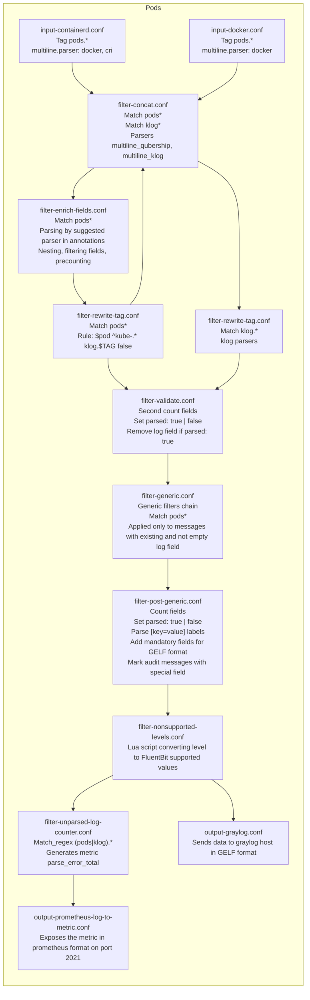

# 📄 Fluent Bit Pipeline Overview

This document describes the Fluent Bit pipeline used for log ingestion and parsing in the Qubership Logging Operator.
It supports multiple log formats and dynamically selects parsers based on pod annotations.

---

## ✅ Supported Log Contracts

Fluent Bit can parse logs in the following formats:

<!-- markdownlint-disable line-length -->
| Format       | Description                                                                                                                                                                                                                                |
| ------------ | ------------------------------------------------------------------------------------------------------------------------------------------------------------------------------------------------------------------------------------------ |
| `logfmt`     | Key-value structured logs. See more details in [logfmt](https://brandur.org/logfmt).                                                                                                       |
| `json`       | Standard JSON format. For better readability, it's recommended to use only flattened JSON without nested structures. See more details in [JSON logs](./cookbook/log-formats.md#json-logs). |
| `qubership`  | The unified logging format used by **Qubership Cloud** microservices. See more details in [Qubership log format](./cookbook/log-formats.md#qubership-log-format)                           |
<!-- markdownlint-enable line-length -->

## Third-Party Log Formats

The FluentBit pipeline includes parsers for the following third-party components:

* PostgreSQL
* OpenSearch
* Cassandra
* MongoDB
* Consul
* FluentBit
* Nginx
* Jaeger

Log messages from third-party components are routed to the appropriate parser based on the pod or container name.

## Parser Selection via Pod Annotations

The parser used for each log message is determined dynamically based on pod annotations:

```yaml
annotations:
  fluentbit.io/parser:: logfmt
```

If no annotation is provided, the default parser used is `json`. If the message is parsed by suggested parsed,
it bypasses the generic filters chain and is sent to outputs. Otherwise the log message passes through
the generic filters chain, and if it matches any parser from the list of available parsers - additional fields
appear in the record, the FluentBit pipeline adds a `parsed` field with the value `true`. If the message does not match
any defined parser, it will be marked with `parsed: false`.

## Pipeline Design

### Pods flowchart



### Detailed Pods parsing flow

<!-- textlint-disable -->
| #   | File                                      | Type/Action                                                          | Scope / Match                     | Purpose                                                                                                     |
|-----|-------------------------------------------|----------------------------------------------------------------------|----------------------------------|-------------------------------------------------------------------------------------------------------------|
| 1   | inputs/input-containerd.conf              | INPUT Tail (multiline.parser docker)                                 | Tag pods.*                        | Reads containerd logs and decodes them with docker parser                                                   |
| 2   | inputs/input-containerd.conf              | INPUT Tail (multiline.parser cri)                                    | Tag pods.*                        | Reads containerd logs and decodes them with cri prefix                                                     |
| 3   | inputs/input-docker.conf                  | INPUT Tail (multiline.parser docker)                                 | Tag pods.*                        | Reads docker logs and parses them with docker parser                                                       |
| 4   | filters/filter-concat.conf                | FILTER multiline (multiline.parser qubership_multiline)              | Match pods*                       | Concatenates messages based on regex for stacktrace multilines                                             |
| 5   | filters/filter-concat.conf                | FILTER multiline (multiline.parser klog_multiline)                   | Match klog*                       | Concatenates messages based on klog trace messages format                                                  |
| 6   | filters/filter-enrich-fields.conf        | FILTER kubernetes (Regex_Parser kube-meta; Merge_Log_Key log_parsed) | Match pods*                       | Enriches messages with metadata. Parses log field with suggested parser in pod's annotations if provided, otherwise tries to parse with json parser. If message parsing succeeded saves parsed data in log_parsed field |
| 7   | filters/filter-enrich-fields.conf        | FILTER nest (Operation lift; Remove_prefix kubernetes.)              | Match pods*                       | Lifts fields nested under kubernetes to the root level                                                     |
| 8   | filters/filter-enrich-fields.conf        | FILTER modify (Hard_rename container_name container; ...)            | Match pods*                       | Renames the fields to be more consistent with Monitoring labels                                           |
| 9   | filters/filter-enrich-fields.conf        | FILTER record_modifier (Allowlist_key pod; ...)                      | Match pods*                       | Leaves only allowed fields in a record                                                                    |
| 10  | filters/filter-enrich-fields.conf        | FILTER lua (Call first_count_fields)                                  | Match pods*                       | Counts original fields                                                                                     |
| 11  | filters/filter-enrich-fields.conf        | FILTER nest (Operation lift; Remove_prefix log_parsed)               | Match pods*                       | Moves parsed data from log_parsed to root level                                                            |
| 12  | filters/filter-rewrite-tag.conf          | FILTER rewrite_tag (Rule $pod  ^kube-.* klog.$TAG  false)            | Match pods*                       | Rewrites tag to klog.$TAG without preserving the original record. Sends the record to the pipeline beginning with the new tag |
| 13  | filters/filter-rewrite-tag.conf          | FILTER parser (Parser klog_entry)                                     | Match klog*                       | Tries to parse with klog_entry parser. The format is described in [Kubernetes system logs](https://kubernetes.io/docs/concepts/cluster-administration/system-logs/) |
| 14  | filters/filter-rewrite-tag.conf          | FILTER parser (Parser klog_trace_entry)                               | Match klog*                       | Tries to parse with klog_trace_entry parser                                                               |
| 15  | filters/filter-events-reader.conf        | FILTER modify                                                         | Match_regex pods.\*events-reader.\* | Renames involvedObjectNamespace field to namespace                                                         |
| 16  | filters/filter-validate.conf             | FILTER lua (Call second_count_fields)                                 | Match_regex (pods\|klog).*         | Counts fields after parsing by parser suggested in annotations (or json by default). Sets parsed: true if new fields count > original fields count, otherwise parsed: false |
| 17  | filters/filter-validate.conf             | FILTER lua (Call kv_parse)                                            | Match pods*                       | Parses [key=value] labels in `log`, only if parsed: true                                                  |
| 18  | filters/filter-validate.conf             | FILTER modify (Set nc_audit_label true)                               | Match_regex pods.\*grafana.\*       | Marks messages from grafana containing specific text mentioned in Condition with `nc_audit_label: true` |
| 19  | filters/filter-validate.conf             | FILTER modify (Set nc_audit_label true)                               | Match_regex pods.\*mongo.\*         | Marks messages from mongo containing specific text mentioned in Condition with `nc_audit_label: true`   |
| 20  | filters/filter-validate.conf             | FILTER modify (Set nc_audit_label true)                               | Match pods*                        | Marks messages containing specific text mentioned in Condition with `nc_audit_label: true`               |
| 21  | filters/filter-validate.conf             | FILTER modify (Condition Key_value_matches parsed true; Copy log short_message) | Match_regex (pods\|klog).*  | If parsed: true, copies the `log` field to the `short_message` (if `short_message` doesn't exist yet) and renames the `log` field to the `original_log` |
| 22  | filters/filter-generic.conf              | FILTER parser (multiple parser filters)                               | Match pods*                        | Contains the generic filter chain that uses common parsers defined in parsers.conf. Records are processed only if the `log` field exists and is not empty |
| 23  | filters/filter-post-generic.conf         | FILTER lua (Call second_count_fields)                                 | Match_regex (pods\|klog).*         | Counts fields after a record passed through the generic chain of filters. If new fields count > original fields count, sets parsed: true, otherwise, parsed: false |
| 24  | filters/filter-post-generic              | FILTER parser (Parser level_parser_common_keep)                       | Match pods*                        | Tries to extract a log's severity level by defined regex in the mentioned parser                            |
| 25  | filters/filter-post-generic.conf         | FILTER modify (Copy log short_message)                                | Match_regex (pods\|klog).*         | Copies the `log` field to the `short_message` if `short_message` doesn't exist yet                         |
| 26  | filters/filter-post-generic.conf         | FILTER lua (Call kv_parse)                                            | Match pods*                        | Parses [key=value] labels in `log`, only if `parsed: true` and the `log` field exists and is not empty    |
| 27  | filters/filter-post-generic.conf         | FILTER modify (Condition Key_value_matches log <regex_here>; Set nc_audit_label true) | Match_regex pods.\*grafana.\* | Marks messages from grafana containing specific text mentioned in Condition with `nc_audit_label: true` |
| 28  | filters/filter-post-generic.conf         | FILTER modify (Condition Key_value_matches log <regex_here>; Set nc_audit_label true) | Match_regex pods.\*mongo.\*   | Marks messages from mongo containing specific text mentioned in Condition with `nc_audit_label: true`    |
| 29  | filters/filter-post-generic.conf         | FILTER modify (Condition Key_value_matches log <regex_here>; Set nc_audit_label true) | Match pods*                   | Marks messages containing specific text mentioned in Condition with `nc_audit_label: true`                |
| 30  | filters/filter-post-generic.conf         | FILTER modify (Condition Key_value_matches parsed true; Hard_rename log original_log) | Match_regex (pods\|klog).*  | If `parsed: true`, renames the `log` field to `original_log` and removes the auxiliary fields used to determine whether the message was parsed |
| 31  | filters/filter-post-generic.conf         | FILTER record_modifier (Record hostname ${HOSTNAME})                  | Match *                            | Adds the `hostname` field, sourced from a FluentBit pod's environment variable, required for the GELF format |
| 32  | filters/filter-post-generic.conf         | FILTER record_modifier (Record nodename ${NODE_NAME})                  | Match *                            | Adds the `nodename` field, sourced from a FluentBit pod's environment variable, required for the GELF format |
| 33  | filters/filter-nonsupported-levels.conf  | FILTER lua (Script /fluent-bit/etc/update_level_syslog.lua)           | Match *                            | Converts the value of the `level` field to FluentBit supported severity levels                             |
| 34  | filters/filter-unparsed-log-counter.conf | FILTER log_to_metrics (Regex parsed ^false$)                          | Match_regex (pods\|klog).*         | Generates the prometheus metric `parse_error_total`                                                        |
| 35  | outputs/output-graylog.conf              | OUTPUT gelf                                                            | Match_regex (audit\|system\|pods\|klog).* | Sends data in GELF format to graylog host defined in the output config                                     |
| 36  | outputs/output-prometheus-log-to-metrics.conf | OUTPUT prometheus_exporter                                      | Match parse_error_metrics          | Exposes the metric `parse_error_total` to the `2021` port                                                  |
<!-- textlint-enable -->
