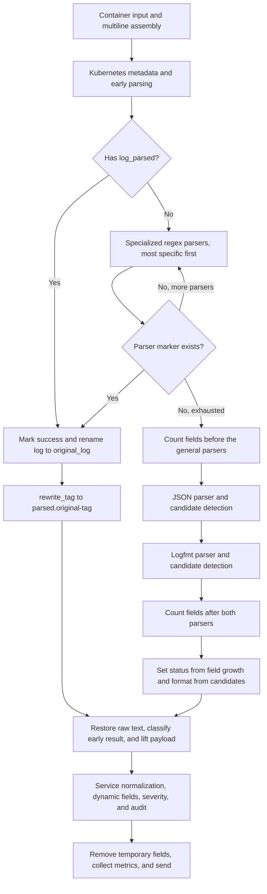

# 📄 Fluent Bit Pipeline Overview

This document describes the Fluent Bit pipeline used for log ingestion and parsing in the Qubership Logging Operator.
It supports multiple log formats and dynamically selects parsers based on pod annotations.

---

## ✅ Supported Log Contracts

Fluent Bit can parse logs in the following formats:

<!-- markdownlint-disable line-length -->
| Format      | Description                                                                                                                                                                                |
| ----------- | ------------------------------------------------------------------------------------------------------------------------------------------------------------------------------------------ |
| `logfmt`    | Key-value structured logs. See more details in [logfmt](https://brandur.org/logfmt).                                                                                                       |
| `json`      | Standard JSON format. For better readability, it's recommended to use only flattened JSON without nested structures. See more details in [JSON logs](./cookbook/log-formats.md#json-logs). |
| `qubership` | The unified logging format used by **Qubership Cloud** microservices. See more details in [Qubership log format](./cookbook/log-formats.md#qubership-log-format)                           |
<!-- markdownlint-enable line-length -->

## Third-Party Log Formats

The FluentBit pipeline includes dedicated parsers for the following third-party components:

* PostgreSQL
* OpenSearch
* Cassandra
* Consul
* FluentBit
* Nginx

Log messages from third-party components are routed to the appropriate parser based on the pod or container name.
MongoDB structured logs and Jaeger logs use the JSON parser, followed by component-specific field normalization.

## Parser Selection via Pod Annotations

The parser used for each log message is determined dynamically based on pod annotations:

```yaml
annotations:
  fluentbit.io/parser: logfmt
```

Without an annotation, the Kubernetes filter attempts JSON parsing. A nonempty result is stored in `log_parsed`.
The pipeline marks this record as successful, renames `log` to `original_log`, and emits it with a temporary
`parsed.` tag prefix. Generic parsers match only the original `pods` and `klog` tags, while common normalization
accepts both forms. The payload remains nested until the final processing stage.

## Pipeline design


```mermaid
flowchart TD
    Input[Container input and multiline assembly] --> Kube[Kubernetes metadata and early parsing]
    Kube --> Early{Has log_parsed?}
    Early -- Yes --> Save[Mark success and rename log to original_log]
    Save --> Route[rewrite_tag to parsed.original-tag]
    Early -- No --> Specific[Specialized regex parsers, most specific first]
    Specific --> Matched{Parser marker exists?}
    Matched -- Yes --> Save
    Matched -- No, more parsers --> Specific
    Matched -- No, exhausted --> Before[Count fields before the general parsers]
    Before --> JSON[JSON parser and candidate detection]
    JSON --> Logfmt[Logfmt parser and candidate detection]
    Logfmt --> After[Count fields after both parsers]
    After --> Status[Set status from field growth and format from candidates]
    Route --> Final[Restore raw text, classify early result, and lift payload]
    Status --> Final
    Final --> Normalize[Service normalization, dynamic fields, severity, and audit]
    Normalize --> Output[Remove temporary fields, collect metrics, and send]
```

### Early parsing

`filter-validate.conf` checks `log_parsed` with a native `modify` condition. It does not count fields or inspect the
format marker. The Kubernetes filter does not create this container for an empty result such as `{}`. A
`rewrite_tag` filter changes `pods...` to `parsed.pods...` and `klog...` to `parsed.klog...`, then drops the original
record. This makes the early result bypass the generic chain instead of merely making its parser keys ineffective.
The presence of `log_parsed` is the parsing-success signal because Fluent Bit creates it only after `Merge_Log`
successfully applies the selected parser. This avoids false failures when parsed fields replace existing metadata.

After the generic chain, `filter-post-generic.conf` identifies known regex formats through markers inside
`log_parsed`. JSON and logfmt use the raw text's external structure when no known regex marker exists. A custom
annotation parser can therefore produce `parse_status: success` with `parse_format: unknown`.

The raw text is restored only after generic parsing, so dynamic Qubership key-value extraction and audit
classification can still use it. Lifting the early payload happens before service and severity normalization.
Bracketed `[key=value]` fields are extracted only from records matched by the Qubership parser.

### Specialized parsing

Both standalone Fluent Bit and the aggregator use this order:

1. Klog trace, then general klog.
2. CoreDNS and Nginx ingress.
3. Cassandra, Consul, and PostgreSQL.
4. Fluent Bit, OpenSearch, and Calico TCP.
5. The generalized Qubership format.

Pod-name restrictions still apply to service-specific parsers. Klog parsers accept both `pods` and `klog` tags.
Each regex emits a one-character, format-specific `__<parser>_candidate` marker as part of a successful parse.
A following `modify` filter sets the status and format and renames `log` to `original_log`. Later parsers cannot
overwrite the selected result. The Qubership parser also accepts compatible Java-style records without key-value
fields; these records are classified as `qubership`.

### General parsing

Only records that still have `log` are counted. Two Lua calls surround the entire JSON/logfmt block; there is no
field count between the parsers. Successful early and specialized records return from these callbacks without
counting fields or adding `parse_field_count`.

The comparison excludes both candidate markers and the status, format, and count fields. Candidate detection alone
does not establish success. Field growth sets `parse_status: success`; the candidates select `json` or `logfmt`.
Growth without a candidate leaves the format unknown. No growth sets the status to failed.

This remains a heuristic: an empty object or a parse that only replaces existing fields does not establish success.
Both general parsers see the preserved raw text, so changes to their behavior need overlap regression tests.
Extracting a severity level afterward does not turn an unrecognized record into a successful structural parse.
This fallback runs only when the selected parser did not supply `level`.

### Internal fields and metadata

`log_parsed`, `original_log`, the candidate markers, and count/status fields are reserved for pipeline processing.
Application payloads must not supply internal control fields. Temporary markers and raw-log fields are removed
before output. `parse_field_count` is emitted only for records that reach the general parser block.

The `parsed.` prefix is present while common and custom filters run. Custom filters and outputs that use tag-specific
matching must accept both the original tag and its `parsed.` form, for example
`Match_regex (parsed\.)?pods.*`. Built-in filters and outputs already do this. HTTP routing removes either form and
emits the same `out_*` tags as before.

Delaying `lift` isolates early payload fields during format recognition. It does not resolve metadata collisions
at the final lift, or collisions produced by generic parsers. Metadata precedence remains a separate change; this
refactor does not claim to fix issue #331.

### Expected fields in result logs

The current FluentBit pipeline is designed to determine whether a log entry has been successfully parsed,
identify its format, and detect its severity level.

If the log structure matches any of the supported log formats,
the following fields must always be present in the resulting log output:

1) level – The GELF/syslog-compatible severity level of the log.
   Must be one of: `debug`, `info`, `notice`, `warning`, `err`, `crit`, `alert`, `emerg`.
   If the original severity level cannot be detected, the level is set to info.
2) detected_level – The Grafana-friendly severity level derived from the same source value.
   Possible values: `trace`, `debug`, `info`, `warn`, `error`, `critical`.
   This field is intended for HTTP-based backends such as VictoriaLogs and for adapters that emulate Loki responses.
3) parse_status – Indicates whether the log was successfully parsed.
   Possible values: success, failed.
4) parse_format – The detected original log format.
   Possible values: `json`, `logfmt`, `klog`, `qubership`, `opensearch`, and other third-party formats.
   MongoDB structured logs and Jaeger logs are reported as `json`.
5) log_category – The source type of the log. Possible values: container, audit, system, k8s_events.
6) parse_level_unknown – Indicates that the original severity level could not be detected
   or did not match any known severity levels.
7) namespace – The namespace of the log source. Present only if the log originates from a Kubernetes container.
8) pod – The pod of the log source. Present only if the log originates from a Kubernetes container.
9) container – The container of the log source. Present only if the log originates from a Kubernetes container.
10) nodename – The Kubernetes node where the log source is located.
11) hostname – The FluentBit pod that processed and sent the log.
12) labels - The set of labels from the pod originated the log.
