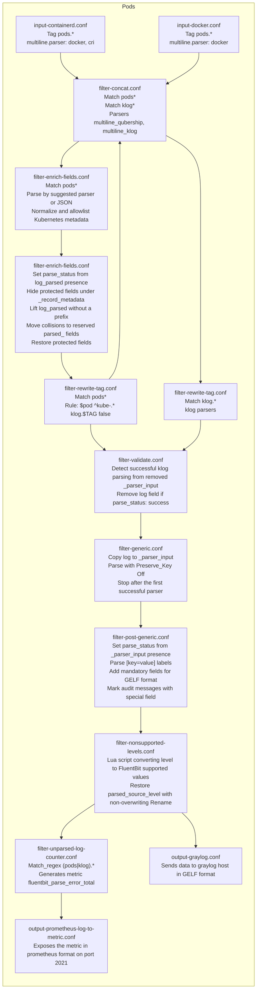

# 📄 Fluent Bit Pipeline Overview

This document describes the Fluent Bit pipeline used for log ingestion and parsing in the Qubership Logging Operator.
It supports multiple log formats and dynamically selects parsers based on pod annotations.

---

## ✅ Supported Log Contracts

Fluent Bit can parse logs in the following formats:

<!-- markdownlint-disable line-length -->
| Format      | Description                                                                                                                                                                                |
| ----------- | ------------------------------------------------------------------------------------------------------------------------------------------------------------------------------------------ |
| `logfmt`    | Key-value structured logs. See more details in [logfmt](https://brandur.org/logfmt).                                                                                                       |
| `json`      | Standard JSON format. For better readability, it's recommended to use only flattened JSON without nested structures. See more details in [JSON logs](./cookbook/log-formats.md#json-logs). |
| `qubership` | The unified logging format used by **Qubership Cloud** microservices. See more details in [Qubership log format](./cookbook/log-formats.md#qubership-log-format)                           |
<!-- markdownlint-enable line-length -->

## Third-Party Log Formats

The FluentBit pipeline includes parsers for the following third-party components:

* PostgreSQL
* OpenSearch
* Cassandra
* MongoDB
* Consul
* FluentBit
* Nginx
* Jaeger

Log messages from third-party components are routed to the appropriate parser based on the pod or container name.

## Parser Selection via Pod Annotations

The parser used for each log message is determined dynamically based on pod annotations:

```yaml
annotations:
  fluentbit.io/parser:: logfmt
```

If no annotation is provided, the Kubernetes filter uses the `json` parser. A successful Kubernetes parser creates
`log_parsed`, which marks the record as parsed and bypasses the generic parser chain.

For other records, FluentBit copies `log` to the reserved `_parser_input` field. Generic parsers use
`Preserve_Key Off`, so the first successful parser removes `_parser_input`. The pipeline uses its absence to set
`parse_status: success`. If every parser leaves `_parser_input` intact, the status remains `failed`.

## Pipeline Design

### Pods flowchart


```mermaid
flowchart LR
    subgraph Pods
        IC["input-containerd.conf<br/>Tag pods.*<br/>multiline.parser: docker, cri" ] --> FC
        ID["input-docker.conf<br/>Tag pods.*<br/>multiline.parser: docker"] --> FC
        FC["filter-concat.conf<br/>Match pods*<br/>Match klog*<br/>Parsers multiline_qubership, multiline_klog"] --> FK
        FC["filter-concat.conf<br/>Match pods*<br/>Match klog*<br/>Parsers multiline_qubership, multiline_klog"] --> FRTP
        FK["filter-enrich-fields.conf<br/>Match pods*<br/>Parse by suggested parser or JSON<br/>Normalize and allowlist Kubernetes metadata"] --> FPC
        FPC["filter-enrich-fields.conf<br/>Set parse_status from log_parsed presence<br/>Hide protected fields under _record_metadata<br/>Lift log_parsed without a prefix<br/>Move collisions to reserved parsed_ fields<br/>Restore protected fields"] --> FRT
        FRT["filter-rewrite-tag.conf<br/>Match pods*<br/>Rule: $pod ^kube-.* klog.$TAG false"] --> FC
        FRT["filter-rewrite-tag.conf<br/>Match pods*<br/>Rule: $pod ^kube-.* klog.$TAG false"] --> FVALID
        FRTP["filter-rewrite-tag.conf<br/>Match klog.*<br/>klog parsers"] --> FVALID
        FVALID["filter-validate.conf<br/>Detect successful klog parsing from removed _parser_input<br/>Remove log field if parse_status: success"] --> FGEN
        FGEN["filter-generic.conf<br/>Copy log to _parser_input<br/>Parse with Preserve_Key Off<br/>Stop after the first successful parser"] --> FPGEN
        FPGEN["filter-post-generic.conf<br/>Set parse_status from _parser_input presence<br/>Parse [key=value] labels<br/>Add mandatory fields for GELF format<br/>Mark audit messages with special field"] --> FNL
        FNL["filter-nonsupported-levels.conf<br/>Lua script converting level to FluentBit supported values<br/>Restore parsed_source_level with non-overwriting Rename"] --> FULC
        FNL["filter-nonsupported-levels.conf<br/>Lua script converting level to FluentBit supported values<br/>Restore parsed_source_level with non-overwriting Rename"] --> OGRAY
        OGRAY["output-graylog.conf<br/>Sends data to graylog host in GELF format"]
        FULC["filter-unparsed-log-counter.conf<br/>Match_regex (pods|klog).*<br/>Generates metric fluentbit_parse_error_total"] --> OPLTM
        OPLTM["output-prometheus-log-to-metric.conf</br>Exposes the metric in prometheus format on port 2021"]
    end
```

### Detailed Pods parsing flow

<!-- textlint-disable -->
| #   | File                                          | Type/Action                                                                           | Scope / Match                             | Purpose                                                                                                                                                                                                                      |
| --- | --------------------------------------------- | ------------------------------------------------------------------------------------- | ----------------------------------------- | ---------------------------------------------------------------------------------------------------------------------------------------------------------------------------------------------------------------------------- |
| 1   | inputs/input-containerd.conf                  | INPUT Tail (multiline.parser docker)                                                  | Tag pods.*                                | Reads containerd logs and decodes them with docker parser                                                                                                                                                                    |
| 2   | inputs/input-containerd.conf                  | INPUT Tail (multiline.parser cri)                                                     | Tag pods.*                                | Reads containerd logs and decodes them with cri prefix                                                                                                                                                                       |
| 3   | inputs/input-docker.conf                      | INPUT Tail (multiline.parser docker)                                                  | Tag pods.*                                | Reads docker logs and parses them with docker parser                                                                                                                                                                         |
| 4   | filters/filter-concat.conf                    | FILTER multiline (multiline.parser qubership_multiline)                               | Match pods*                               | Concatenates messages based on regex for stacktrace multiline                                                                                                                                                                |
| 5   | filters/filter-concat.conf                    | FILTER multiline (multiline.parser klog_multiline)                                    | Match klog*                               | Concatenates messages based on klog trace messages format                                                                                                                                                                    |
| 6   | filters/filter-enrich-fields.conf             | FILTER kubernetes (Regex_Parser kube-meta; Merge_Log_Key log_parsed)                  | Match pods*                               | Enriches messages with metadata. Parses log field with suggested parser in pod's annotations if provided, otherwise tries to parse with json parser. If message parsing succeeded saves parsed data in log_parsed field      |
| 7   | filters/filter-enrich-fields.conf             | FILTER nest (Operation lift; Remove_prefix kubernetes.)                               | Match pods*                               | Lifts fields nested under kubernetes to the root level                                                                                                                                                                       |
| 8   | filters/filter-enrich-fields.conf             | FILTER modify (Hard_rename container_name container; ...)                             | Match pods*                               | Renames the fields to be more consistent with Monitoring labels                                                                                                                                                              |
| 9   | filters/filter-enrich-fields.conf             | FILTER record_modifier (Allowlist_key pod; ...)                                       | Match pods*                               | Leaves only allowed fields in a record                                                                                                                                                                                       |
| 10  | filters/filter-enrich-fields.conf             | FILTER modify (Set parse_status failed)                                               | Match pods*                               | Initializes parsing status before checking whether the Kubernetes filter created `log_parsed`.                                                                                                                               |
| 11  | filters/filter-enrich-fields.conf             | FILTER modify (Condition Key_exists log_parsed; Set parse_status success)             | Match pods*                               | Marks records parsed by the Kubernetes filter without counting fields.                                                                                                                                                       |
| 12  | filters/filter-enrich-fields.conf             | FILTER nest (Operation nest; Nest_under _record_metadata)                             | Match pods*                               | Moves protected fields to the internal `_record_metadata` object while application fields are extracted.                                                                                                                     |
| 13  | filters/filter-enrich-fields.conf             | FILTER nest (Operation lift; Nested_under log_parsed)                                 | Match pods*                               | Moves application fields from `log_parsed` to the root without changing their names.                                                                                                                                         |
| 14  | filters/filter-enrich-fields.conf             | FILTER modify (Hard_rename namespace parsed_namespace; ...)                           | Match pods*                               | Moves application fields that use protected names to their reserved `parsed_*` names.                                                                                                                                        |
| 15  | filters/filter-enrich-fields.conf             | FILTER nest (Operation lift; Nested_under _record_metadata)                           | Match pods*                               | Restores authoritative metadata and other protected fields.                                                                                                                                                                  |
| 16  | filters/filter-rewrite-tag.conf               | FILTER rewrite_tag (Rule $pod  ^kube-.* klog.$TAG  false)                             | Match pods*                               | Rewrites tag to klog.$TAG without preserving the original record. Sends the record to the pipeline beginning with the new tag                                                                                                |
| 17  | filters/filter-rewrite-tag.conf               | FILTER modify (Copy log _parser_input)                                                | Match klog*                               | Copies the source message to the reserved parser input field.                                                                                                                                                                |
| 18  | filters/filter-rewrite-tag.conf               | FILTER parser (Parser klog_entry; Preserve_Key Off)                                   | Match klog*                               | Parses Kubernetes system logs and removes `_parser_input` on success.                                                                                                                                                        |
| 19  | filters/filter-rewrite-tag.conf               | FILTER parser (Parser klog_trace_entry; Preserve_Key Off)                             | Match klog*                               | Parses Kubernetes system trace logs and removes `_parser_input` on success.                                                                                                                                                  |
| 20  | filters/filter-events-reader.conf             | FILTER modify                                                                         | Match_regex pods.\*events-reader.\*       | Renames involvedObjectNamespace field to namespace                                                                                                                                                                           |
| 21  | filters/filter-validate.conf                  | FILTER modify (Condition Key_does_not_exist _parser_input)                            | Match klog*                               | Marks klog records as successfully parsed when a parser removed `_parser_input`.                                                                                                                                             |
| 22  | filters/filter-validate.conf                  | FILTER lua (Call kv_parse)                                                            | Match pods*                               | Parses [key=value] labels in `log`, only if `parse_status: success`                                                                                                                                                                     |
| 23  | filters/filter-validate.conf                  | FILTER modify (Set nc_audit_label true)                                               | Match_regex pods.\*grafana.\*             | Marks messages from grafana containing specific text mentioned in Condition with `nc_audit_label: true`                                                                                                                      |
| 24  | filters/filter-validate.conf                  | FILTER modify (Set nc_audit_label true)                                               | Match_regex pods.\*mongo.\*               | Marks messages from mongo containing specific text mentioned in Condition with `nc_audit_label: true`                                                                                                                        |
| 25  | filters/filter-validate.conf                  | FILTER modify (Set nc_audit_label true)                                               | Match pods*                               | Marks messages containing specific text mentioned in Condition with `nc_audit_label: true`                                                                                                                                   |
| 26  | filters/filter-validate.conf                  | FILTER modify (Condition Key_value_matches parse_status success; Copy log short_message)       | Match_regex (pods\|klog).*                | If `parse_status: success`, copies the `log` field to the `short_message` (if `short_message` doesn't exist yet) and renames the `log` field to the `original_log`                                                                      |
| 27  | filters/filter-generic.conf                   | FILTER modify (Copy log _parser_input); FILTER parser (Preserve_Key Off)              | Match pods*                               | Runs generic parsers against `_parser_input`. The first successful parser removes the field, so the remaining parsers skip the record.                                                                                       |
| 28  | filters/filter-post-generic.conf              | FILTER modify (Condition Key_does_not_exist _parser_input)                            | Match pods*                               | Marks a record as successfully parsed when a generic parser removed `_parser_input`.                                                                                                                                         |
| 29  | filters/filter-post-generic                   | FILTER parser (Parser level_parser_common_keep)                                       | Match pods*                               | Tries to extract a log's severity level by defined regex in the mentioned parser                                                                                                                                             |
| 30  | filters/filter-post-generic.conf              | FILTER modify (Copy log short_message)                                                | Match_regex (pods\|klog).*                | Copies the `log` field to the `short_message` if `short_message` doesn't exist yet                                                                                                                                           |
| 31  | filters/filter-post-generic.conf              | FILTER lua (Call kv_parse)                                                            | Match pods*                               | Parses [key=value] labels in `log`, only if ``parse_status: success`` and the `log` field exists and is not empty                                                                                                                       |
| 32  | filters/filter-post-generic.conf              | FILTER modify (Condition Key_value_matches log <regex_here>; Set nc_audit_label true) | Match_regex pods.\*grafana.\*             | Marks messages from grafana containing specific text mentioned in Condition with `nc_audit_label: true`                                                                                                                      |
| 33  | filters/filter-post-generic.conf              | FILTER modify (Condition Key_value_matches log <regex_here>; Set nc_audit_label true) | Match_regex pods.\*mongo.\*               | Marks messages from mongo containing specific text mentioned in Condition with `nc_audit_label: true`                                                                                                                        |
| 34  | filters/filter-post-generic.conf              | FILTER modify (Condition Key_value_matches log <regex_here>; Set nc_audit_label true) | Match pods*                               | Marks messages containing specific text mentioned in Condition with `nc_audit_label: true`                                                                                                                                   |
| 35  | filters/filter-post-generic.conf              | FILTER modify (Condition Key_value_matches parsed true; Hard_rename log original_log) | Match_regex (pods\|klog).*                | If `parsed: true`, renames the `log` field to `original_log` and removes the auxiliary fields used to determine whether the message was parsed                                                                               |
| 36  | filters/filter-post-generic.conf              | FILTER record_modifier (Record hostname ${HOSTNAME})                                  | Match *                                   | Adds the `hostname` field, sourced from a FluentBit pod's environment variable, required for the GELF format                                                                                                                 |
| 37  | filters/filter-post-generic.conf              | FILTER record_modifier (Record nodename ${NODE_NAME})                                 | Match *                                   | Adds the `nodename` field, sourced from a FluentBit pod's environment variable, required for the GELF format                                                                                                                 |
| 38  | filters/filter-nonsupported-levels.conf       | FILTER lua (Script /fluent-bit/etc/update_level_syslog.lua)                           | Match *                                   | Converts the value of the `level` field to FluentBit supported severity levels                                                                                                                                               |
| 39  | filters/filter-nonsupported-levels.conf       | FILTER modify (Rename parsed_source_level source_level)                               | Match *                                   | Restores the application `source_level` only when level normalization did not create the canonical field.                                                                                                                    |
| 40  | filters/filter-unparsed-log-counter.conf      | FILTER log_to_metrics (Regex parsed ^false$)                                          | Match_regex (pods\|klog).*                | Generates the prometheus metric `fluentbit_parse_error_total`                                                                                                                                                                |
| 41  | outputs/output-graylog.conf                   | OUTPUT gelf                                                                           | Match_regex (audit\|system\|pods\|klog).* | Sends data in GELF format to graylog host defined in the output config                                                                                                                                                       |
| 42  | outputs/output-prometheus-log-to-metrics.conf | OUTPUT prometheus_exporter                                                            | Match parse_error_metrics                 | Exposes the metric `fluentbit_parse_error_total` to the `2021` port                                                                                                                                                          |
| 43  | outputs/output-http.conf                      | OUTPUT http                                                                           | Match *                                   | Sends data in json_lines format to HTTP storage backend (VictoriaLogs)                                                                                                                                                       |
<!-- textlint-enable -->

### Reserved fields

The Kubernetes parsing pipeline owns the canonical fields in the table below. If an application payload contains one
of these names, FluentBit moves its value to the corresponding reserved field before restoring the authoritative value.

| Canonical field | Reserved collision field |
| --- | --- |
| `namespace` | `parsed_namespace` |
| `pod` | `parsed_pod` |
| `container` | `parsed_container` |
| `source` | `parsed_source` |
| `labels` | `parsed_labels` |
| `log` | `parsed_log` |
| `time` | `parsed_time` |
| `level` | `parsed_level` |
| `parse_status` | `parsed_parse_status` |
| `source_level` | `parsed_source_level` |

> [!IMPORTANT]
> Service authors must not use `_record_metadata`, `_parser_input`, or `original_log` in structured log payloads.
> FluentBit reserves these fields for internal pipeline state. Using them violates the logging contract and can make
> payload values unavailable.

Service authors must also not define the reserved collision fields listed above. Fields that are not listed keep their
original application-defined names.

### Expected fields in result logs

The current FluentBit pipeline is designed to determine whether a log entry has been successfully parsed,
identify its format, and detect its severity level.

If the log structure matches any of the supported log formats,
the following fields must always be present in the resulting log output:

1) level – The GELF/syslog-compatible severity level of the log.
   Must be one of: `debug`, `info`, `notice`, `warning`, `err`, `crit`, `alert`, `emerg`.
   If the original severity level cannot be detected, the level is set to info.
2) detected_level – The Grafana-friendly severity level derived from the same source value.
   Possible values: `trace`, `debug`, `info`, `warn`, `error`, `critical`.
   This field is intended for HTTP-based backends such as VictoriaLogs and for adapters that emulate Loki responses.
3) parse_status – Indicates whether the log was successfully parsed.
   Possible values: success, failed.
4) parse_format – The detected original log format.
   Possible values: `json`, `logfmt`, `klog`, `qubership`, `java`, `opensearch`, and other third-party formats.
5) log_category – The source type of the log. Possible values: container, audit, system, k8s_events.
6) parse_level_unknown – Indicates that the original severity level could not be detected
   or did not match any known severity levels.
7) namespace – The namespace of the log source. Present only if the log originates from a Kubernetes container.
8) pod – The pod of the log source. Present only if the log originates from a Kubernetes container.
9) container – The container of the log source. Present only if the log originates from a Kubernetes container.
10) nodename – The Kubernetes node where the log source is located.
11) hostname – The FluentBit pod that processed and sent the log.
12) labels - The set of labels from the pod originated the log.
